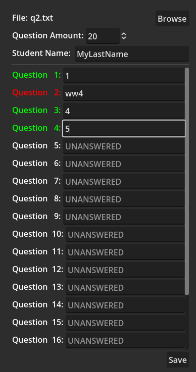

# 134TestTaker
A test taking tool for CSC134 with Professor Bill Mitchel. It is a simple way to keep track of your test questions and answers and allows you to import existing tests in the correct format to verify your answers.



> :warning: **WARNING**: This project is still under development and it is not bug free. Use at your own risk.

> :warning: **WARNING**: This app does not give you answers, it only verifies that it is in the correct format. You must still study and know the material to answer the questions correctly.

> :information_source: **INFO**: This project is not affiliated with Sacramento State University or Professor Bill Mitchel. 

## Download Latest
You can download the latest version of the app from the [releases page](https://github.com/kyperbelt/134TestTaker/releases/tag/v0.0.1)
1. [Windows](https://github.com/kyperbelt/134TestTaker/releases/download/v0.0.1/134QuizTaker.exe)
2. [Linux](https://github.com/kyperbelt/134TestTaker/releases/download/v0.0.1/134QuizTaker.x86_64)
3. [MacOS](https://github.com/kyperbelt/134TestTaker/releases/download/v0.0.1/134QuizTaker.zip)

## Build Instructions

### Requirements
* [Godot 4.0+ stable](https://godotengine.org/download)
  
### Building
1. Clone this repository to your computer.
2. [Import the project into Godot.](https://docs.godotengine.org/en/stable/tutorials/editor/project_manager.html#opening-and-importing-projects)
3. [Export the Project to your target platform](https://docs.godotengine.org/en/stable/tutorials/export/exporting_projects.html)


## Features
* Import existing tests in the correct format to verify your answers.
* Saving and loading of tests.
* Input validation for test questions (Makes sure that they are in the correct integer format)
    > :information_source: **NOTE**: This will not stop you from saving but it will give you a visual aid when the question is not in the correct format. This is just incase the professor changes the format of the test questions.
* Planned:
  * Variable number of test questions.
  * Variable Question format.
  * Configuration File.

## Usage

1. Open up the app and click on the "Browse" button on the top right.
2. Select the file that you want to open, or type the name of a new file and click ok.
   1. If the file exists and its a valid test file, it will load the test questions and answers.
   2. If it is a new file, it will create the new test file with the name you gave it.
3. Enter Your last name into the Student Name field.
4. Enter your answers into the Question Answer fields.'
   1. The app validates that the answers are integers values.
5. Click the "Save" button to save your answers or use the `CTRL+S` shortcut.

### Expected output format: 
```
Student Lastname,1,2,3,4,1, , , , ,2, , , , , , , , , , 
```

## Contributing
Pull requests are welcome. For major changes, please open an issue first to discuss what you would like to change.

For bugs and feature requests, please open an issue.


